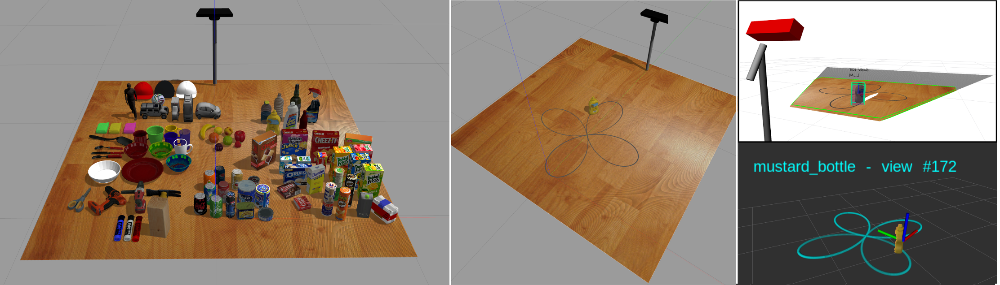

## synthetic_pointcloud_object_dataset V.0.1
###### [Interactive Robot Learning (IRL) lab](https://www.ai.rug.nl/irl-lab/)

<p align="center">
  
</p>
<p align="center">
  Synthetic point cloud object dataset: (left) ninety synthetic objects in Gazebo environment; (center) our simulation environment consisting of a Kinect camera and a table; To capture partial views of the target object, we rotate and move the object in a rose trajectory in front of the camera; (right) As shown in the Rviz, we track the pose of the target object and record 300 partial views of the object (point cloud format *.pcd)
</p>

#

We developed a simulation environment in Gazebo to record a large synthetic object dataset. Towards this goal, we considered 90 simulated household objects, imported from different resources (e.g., the YCB dataset, Gazebo repository, and etc). It should be noted that this is a very challenging dataset for object recognition tasks since we include both basic-level (i.e., objects that are not similar to each other such as apple vs. book) and fine-grained (the object that are very similar together spoon vs. fork) object categories. Furthermore, there are several objects with the same geometry, but different textures, and vice versa. In order to extract partially visible point clouds of an object, we move the object along a rose trajectory in front of the camera and record 300 views of the object. The obtained 27000 partial views are then organized into 90 object categories. 

#Citation

Please adequately refer to the paper any time this dataset is being used. If you do publish a paper where this dataset helped your research, we encourage you to cite the following paper in your publications:

```bib
@ARTICLE{synthetic_pointcloud_dataset,
  author={Kasaei, Hamidreza and Xiong, Songsong},
  journal={}, 
  title={Lifelong Ensemble Learning based on Multiple Representations for Few-Shot Object Recognition}, 
  year={2022},
  doi={}
}
```
